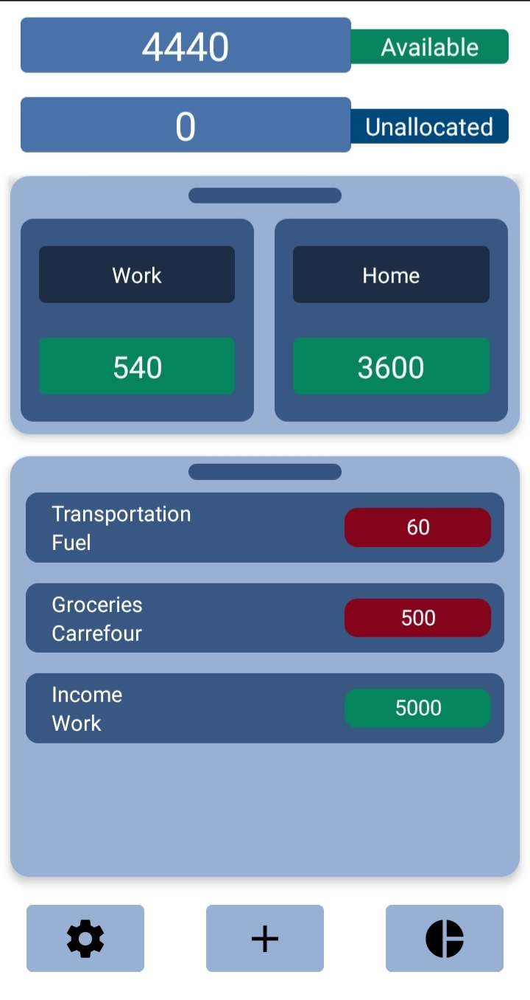
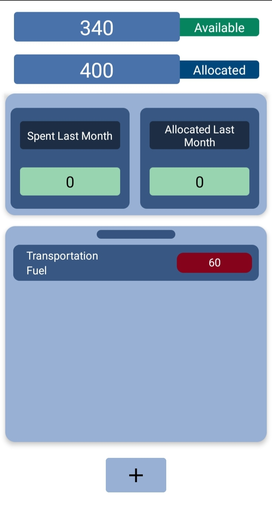
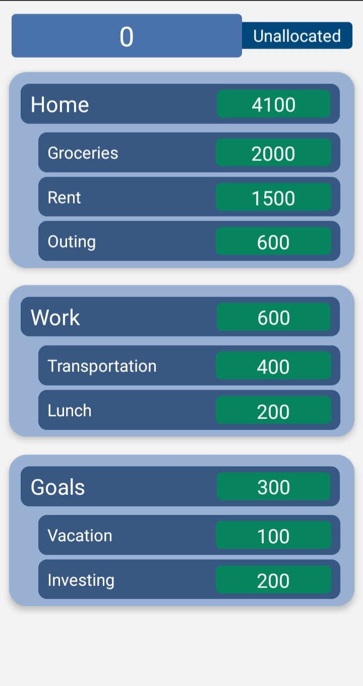
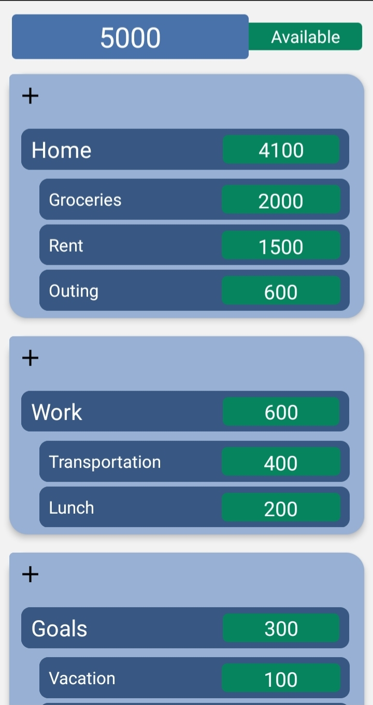

# Fundeaz

Fundeaz, or fund this, is a money management app that uses the Zero-based budgeting to
help you manage your income.

In order to help you budget, you allocate your money into categories. categories can be
thought of as a group in which a part of your spending goes into.

some example of categories are:
- Groceries
- Transportation
- Hobbies
- Outings

# Functionality

the app offers a handful of functionality to help you manage your spending.

these include:
- Graphs to show you your previous months spending
- Category Goals
- allocation page
- category page that show transaction for those categories only
- showing the previous month allocation and spending for categories
- setting custom start of the month for allocation resetting
- sorting categories based on most recent transaction
# Usage Guidance

when you first open the app you are shown the homepage, here you will see different categories, transactions, and the total amount of funds available,
and the amount of money that is unallocated

you can:
- add a transaction: by pressing the add button
- open a list of your categories: by pressing the small bar on top of the smaller rectangle
  - here you can add a category by pressing on the add button
- see a list of your transactions: by pressing the small bar on top the bigger rectangle
  - here you can add a transaction by pressing the add button
- allocate money into categories
  - allocate an amount: swipe right
  - deallocate an amount: swipe left
- edit a transaction: by pressing on one of your transaction

if you click on one of the categories you will be directed to the category page. here you can see the amount allocated and available for
that category. you can also add transactions for that category

# Images

- Home page
  

- Category Page
  

- Allocation Page
  

- Graph Page
  
  

