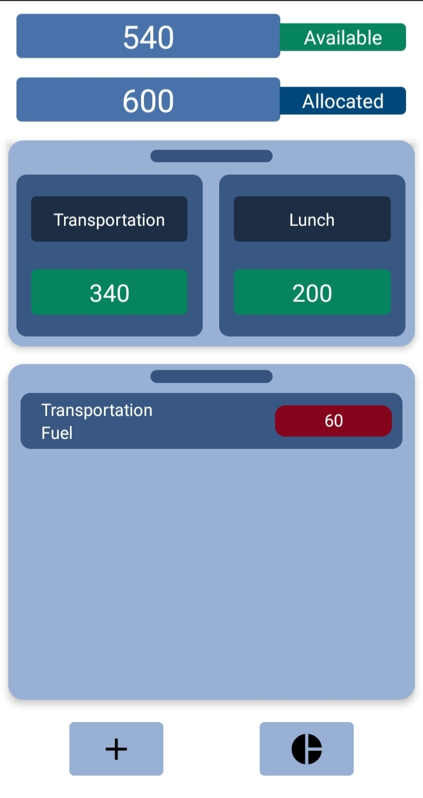

# Fundeaz

Fundeaz, or fund this, is a money management app that uses the Zero-based budgeting to
help you manage your income.

In order to help you budget, you allocate your money into categories. categories can be
thought of as a group in which a part of your spending goes into.

some example of categories are:
- Groceries
- Transportation
- Hobbies
- Outings

you further on categorize your categories using groups, grouping categories together can help
you get a bigger picture of your spending

some example of groups are:
- House
- Work
- Family
- Goals

you do not have to limit yourself with this format so feel free to customize and group your categories as you wish

# Functionality

the app offers a handful of functionality to help you manage your spending.

these include:
- Graphs to show you your previous months spending
- Category Goals
- allocation page
- fund overview page
- category and group page that show transaction for those categories and groups only
- showing the previous month allocation and spending for categories
- setting custom start of the month for allocation resetting
- sorting of groups and categories based on most recent transaction
- adding categories for created groups the fund overview page
# Usage Guidance

when you first open the app you are shown the homepage, here you will see different groups, transactions, and the total amount of funds available,
and the amount of money that is unallocated

you can:
- add a transaction: by pressing the add button
- open a list of your groups: by pressing the small bar on top of the smaller rectangle
  - here you can add a group by pressing on the add button
- see a list of your transactions: by pressing the small bar on top the bigger rectangle
  - here you can add a transaction by pressing the add button
- see an overview of your funds: by pressing the available bar
- allocate money into categories
  - allocate an amount: swipe right
  - deallocate an amount: swipe left
- edit a transaction: by pressing on one of your transaction

after creating your first group you can click on the available bar to create categories for that group, or you are able to click on the group icon to go to the group page.

in the group page the top bar shows the amount that was allocated to this group
for this month, and you can see the total amount of funds available

here you can:
- create categories the same way you created groups
- add and edit transaction for categories of that group
- go to category page

if you click on one of the categories you will be directed to the category page. here you can see the amount allocated and available for
that category. you can also add transactions for that category

# Images

- Home page

- Group Page

- Category Page

- Fund Overview Page

- Allocation Page

- Graph Page

  

